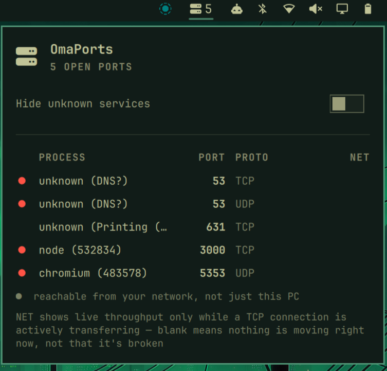

# omaports

A bar-widget plugin for the [Omarchy](https://omarchy.org) shell that shows
how many local ports are currently in use, and which process owns each one.



## Requirements

- `ss` (from `iproute2`, installed by default on Arch/Omarchy).

## Install

```bash
omarchy plugin add https://github.com/jccl1706/omaports.git --enable --yes
```

Or by hand:

```bash
cp -r . ~/.config/omarchy/plugins/io.github.jccl1706.omaports
omarchy-shell shell rescanPlugins
omarchy plugin enable io.github.jccl1706.omaports
```

For local development, a symlink in place of `cp -r` works too, but
`omarchy-shell`'s file watcher does not follow it — after editing QML, run
`omarchy restart shell` rather than relying on hot-reload. Even with a real
(non-symlinked) directory, hot-reload has been observed to pick up layout
changes but keep running a stale version of a changed JS function body in an
already-running widget instance — if behavior doesn't match what you just
edited, restart the shell before assuming the code is wrong.

## Usage

The bar icon shows the number of open ports, refreshed every 30s in the
background and every 4s while the popup is open. Click it for the full list:
process, port number, and protocol.

Ports owned by other users or root (system services like DNS or CUPS) show
as "unknown" — this plugin never asks for a password just to list sockets.
When the port number is a well-known one (53 for DNS, 631 for printing,
etc.), "unknown" gets a guessed hint like `unknown (DNS?)` — the `?` marks
it as an inference from the port number by convention, not something read
from the kernel the way the real process name would be.

A dot next to a row means that port is bound to a real network address
(`0.0.0.0`, `::`, or a specific LAN address) rather than loopback-only —
reachable from other devices on your network, not just this machine. A port
bound to *both* (common for services that also listen on a Docker bridge
address, for example) still gets the dot, since it's exposed either way.

The bar icon highlights and a desktop notification fires when a port opens
that wasn't there on the previous scan — useful for noticing the moment a
dev server or container starts without watching the popup. The highlight
clears the next time you open the popup.

Toggle "Hide unknown services" in the popup to filter the list down to only
processes `ss` could actually name — also available over IPC:
`omarchy-shell io.github.jccl1706.omaports toggleHideUnknown`.

The NET column shows a live `↓in ↑out` throughput for a TCP port with an
active connection right now, sampled once per refresh. It's blank rather
than `0` for anything not currently measurable: UDP ports (no per-socket
byte counters exist for them), a port with no established connections at
the moment, or a port owned by another user/root — the same "unknown"
limitation as the process name, since reading another user's socket
internals needs root and this plugin never asks for a password.

A port Docker publishes to the host shows the owning container's name
(e.g. `my-postgres (docker)`) instead of "unknown" — Docker's own
port-forwarding process normally runs as root, so it's invisible to `ss`
the same way any other root-owned service is, but cross-referencing
`docker ps` fills in what it actually is. This only works if the current
user can reach the Docker socket without a password — in the `docker`
group, or a rootless Docker setup — otherwise it falls back to "unknown"
like everything else this plugin can't attribute, again without ever
prompting for a password.

## Expected ports

Type a comma-separated list of port numbers into "Expected ports" in the
popup (blank turns this off) to flag anything else. A port not on the list
shows its port number in the same accent color as the exposed-network dot,
the bar icon stays flagged for as long as an unexpected port is open (not
just until you next open the popup), and a notification for a newly
opened unexpected port is worded differently from a routine new-port one.
There's no separate dismiss/acknowledge step — adding a port to the list
is what clears its flag. The list matches by port number only, not
protocol or process.

## Removal

```bash
omarchy plugin remove io.github.jccl1706.omaports --yes
```

Or by hand: `omarchy plugin disable io.github.jccl1706.omaports`, then delete
`~/.config/omarchy/plugins/io.github.jccl1706.omaports/`.

## Files

- `manifest.json` — plugin manifest (`kind: bar-widget`)
- `Widget.qml` — the bar icon and popup
- `LICENSE` — MIT

## License

MIT — see [LICENSE](LICENSE).
